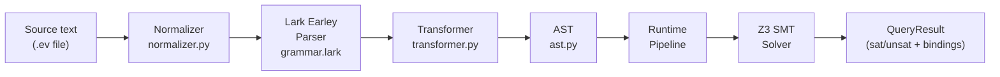
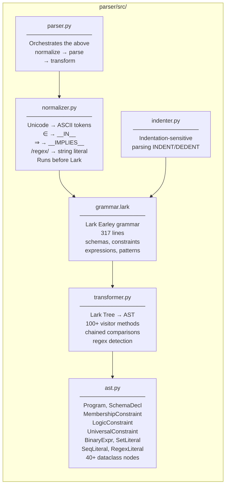
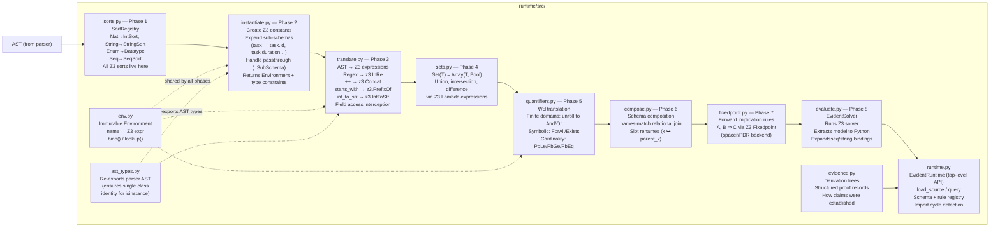
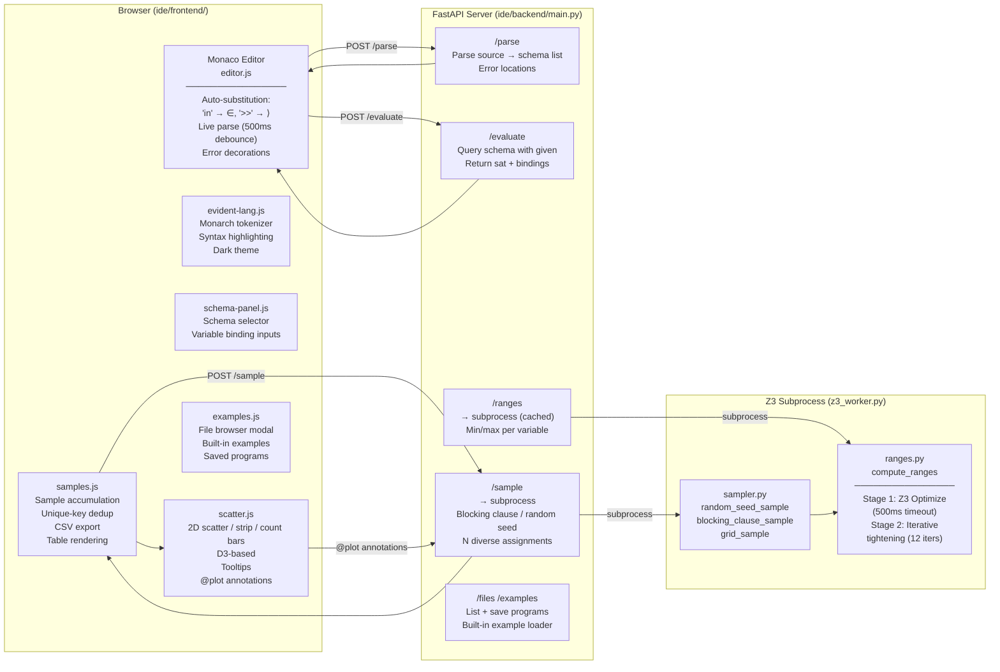
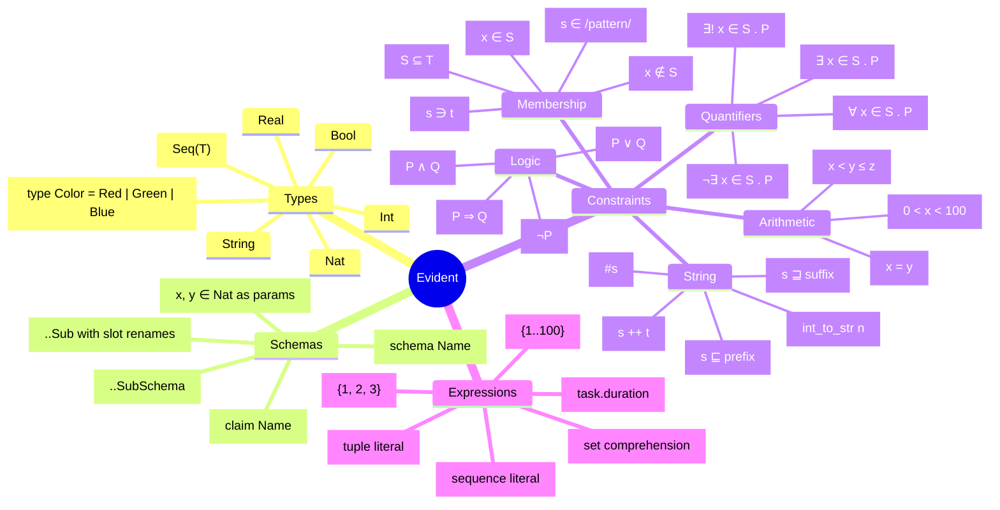
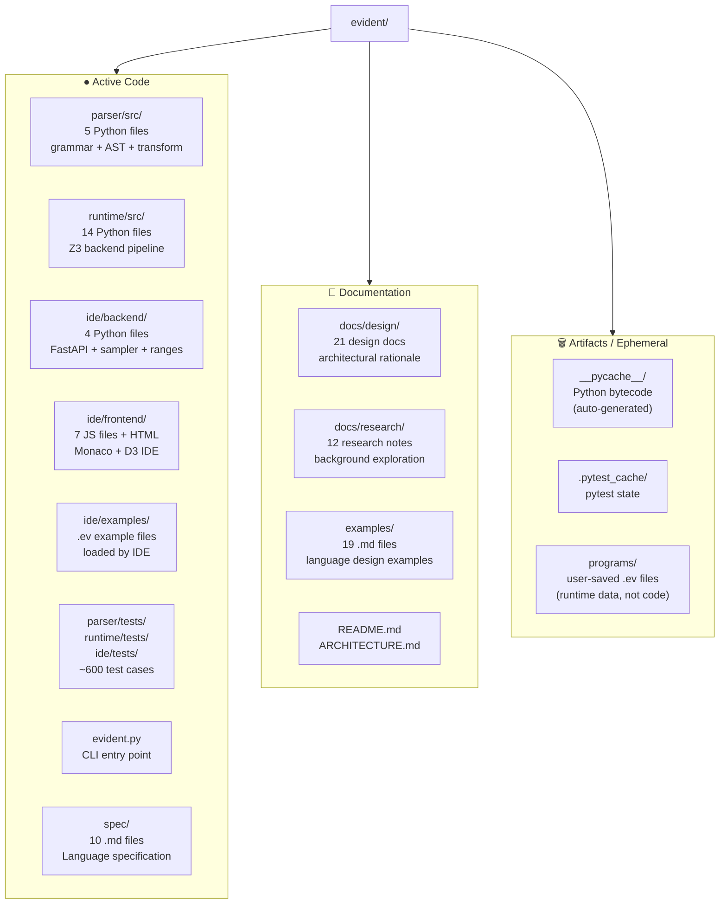

# Evident — Architecture

Evident is a constraint programming language backed by the Z3 SMT solver.
Programs are collections of constraints over sets; querying a schema asks whether
a satisfying assignment exists. The solver works bidirectionally — pin any subset
of variables and it solves for the rest.

---

## Pipeline Overview

Source text travels through a normalizer, parser, and multi-phase runtime before
reaching Z3. The IDE sits on top as a thin HTTP layer.

---

## Parser

The grammar is the single source of truth for syntax. The normalizer runs first
to make the grammar purely ASCII.

---

## Runtime Pipeline

Eight modules form an ordered pipeline. Each stage transforms its input and
passes a richer structure to the next.

---

## IDE Architecture

The IDE is a single-page app backed by a FastAPI server. Z3 operations that could
crash the server process (sampling, range-finding) run in an isolated subprocess.

---

## Language Features Map

---

## Directory Map: Active vs. Artifact

---

## What You'd Need to Rebuild to Switch Languages

The implementation has three largely independent layers. Each has a different
porting cost.

```mermaid
flowchart LR
    subgraph Easy ["🟢 Easy to Port\n(language-agnostic or trivial)"]
        G["grammar.lark\nLark-specific syntax but\nEarley grammars are standard.\nPort: rewrite for target parser\nor use Lark via subprocess"]
        N["normalizer.py\n~80 lines of string replacement.\nPort: 1–2 hours in any language"]
        A["ast.py\nSimple data types / structs.\nPort: 1 day in any language"]
        FE["ide/frontend/\nAlready JS — runs in any browser.\nNo porting needed"]
    end

    subgraph Medium ["🟡 Medium Effort\n(logic to rewrite, no exotic deps)"]
        T["transformer.py\n~730 lines of tree-walking.\nPort: 2–3 days — mostly\nmechanical visitor pattern"]
        IB["ide/backend/\nFastAPI HTTP endpoints.\nPort: 1–2 days in any\nweb framework"]
        SM["sampler.py / ranges.py\nSampling logic + Z3 Optimize.\nPort: 1 day (if Z3 bindings exist)"]
    end

    subgraph Hard ["🔴 Hard\n(deep Z3 integration)"]
        RT["runtime/ (10 modules)\n~3,500 lines of Z3 API usage.\nSorts, quantifiers, sets,\nsequences, fixedpoint,\nmodel extraction.\nPort: 2–4 weeks"]
    end

    subgraph Z3Lang ["Z3 Bindings by Language"]
        PY2["Python ✅ (current)"]
        TS["TypeScript / JS\nz3.wasm — full Z3 in browser\nNo server needed!"]
        RS["Rust\nz3-sys / z3 crates\nStrong type system"]
        CS["C# / F#\nMicrosoft.Z3 (official)"]
        JV["Java\ncom.microsoft.z3"]
        OC["OCaml\nvia C bindings"]
    end

    Easy --> Medium --> Hard
    Hard --> Z3Lang
```

### The Interesting Case: TypeScript + z3.wasm

Z3 ships as a WebAssembly module (`z3.wasm`) with a full TypeScript API.
Porting to TypeScript would mean:

- **No server required** — the entire runtime runs in the browser
- **Frontend stays as-is** (Monaco, D3)
- **Grammar and normalizer** port straightforwardly
- **Runtime modules** are the main effort — same logic, different Z3 API surface

This would make Evident a fully browser-resident tool with no Python dependency.

---

## Key Invariants (What Must Stay True in Any Port)

| Invariant | Why |
|---|---|
| Normalizer runs before parser | Grammar stays purely ASCII; Unicode handled in one place |
| Single AST class identity | `isinstance()` checks break if two module instances define the same class |
| SortRegistry owns all Z3 sorts | Enum variant names must be globally unique; duplicate detection centralised |
| Z3 runs in isolated subprocess | Z3's C library is not thread-safe; server crashes otherwise |
| Sets encoded as `Array(T, Bool)` | Z3 has no native finite-set sort; array theory is the standard encoding |
| Immutable environments | Sharing environments across branches requires no mutation |
| Normalizer handles both Unicode AND word keywords | `in`, `not in`, `subset` etc. map to same `__TOKEN__` as their symbol equivalents |

---

## External Dependencies

| Dependency | Role | Swappable? |
|---|---|---|
| **Z3** | SMT solver — the core engine | No (would need to pick a different solver) |
| **Lark** | Earley parser | Yes — any Earley/GLR parser |
| **FastAPI + Uvicorn** | HTTP server | Yes — any ASGI/web framework |
| **Monaco Editor** | Code editor | Yes — CodeMirror 6, Ace, etc. |
| **D3 v7** | 2D scatter plots | Yes — Vega-Lite, Chart.js, Plotly |
| **Playwright** | E2E tests | Yes — Puppeteer, Selenium |
