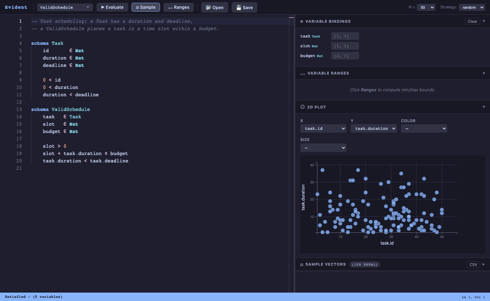
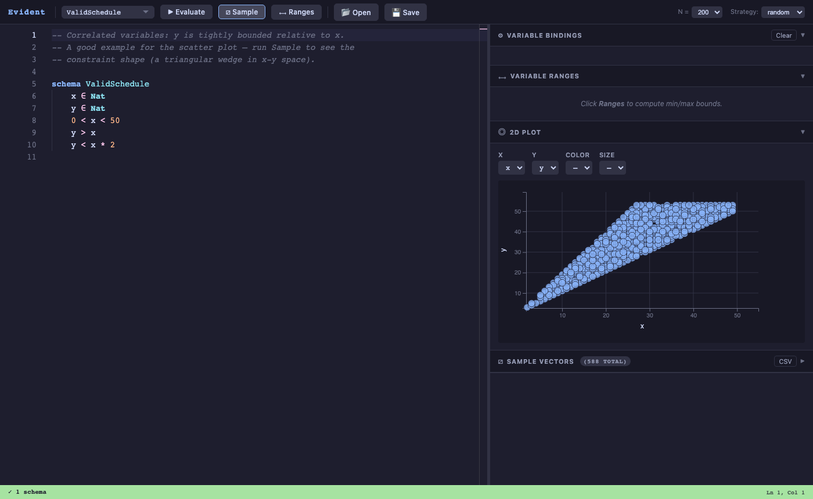
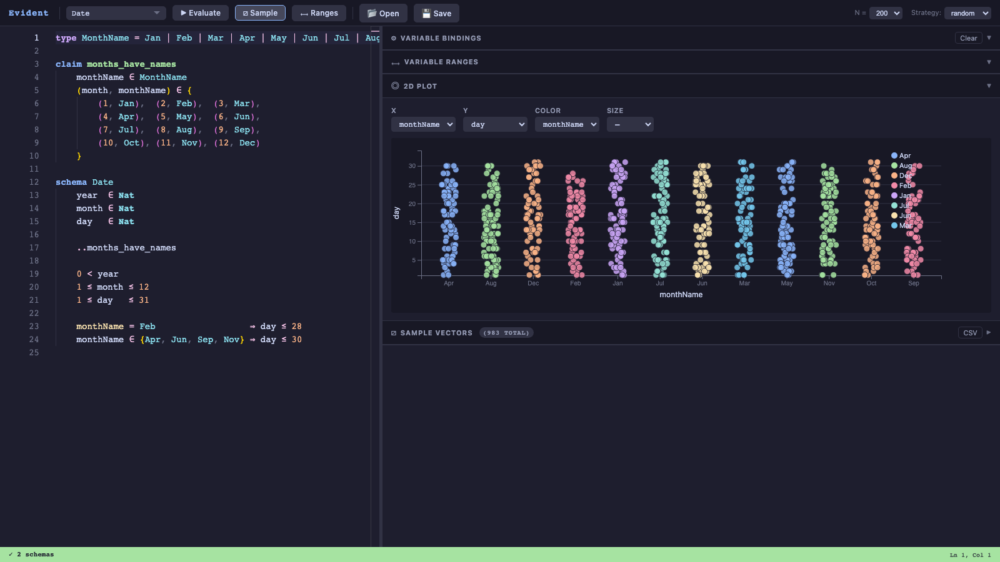

# Evident

A constraint programming language where programs are collections of constraints over sets, and a Z3 SMT solver finds satisfying assignments. The central abstraction is the **schema** — a named set defined by membership conditions.



## What it is

In most languages you write a procedure that computes a result. In Evident you write **what the result must satisfy**, and the solver finds it for you.

```
schema Task
    id       ∈ Nat
    duration ∈ Nat
    deadline ∈ Nat
    duration < deadline

schema ValidSchedule
    task   ∈ Task
    slot   ∈ Nat
    budget ∈ Nat
    slot > 0
    slot + task.duration ≤ budget
```

Query `ValidSchedule` and the solver returns a concrete assignment: `task.id=3, task.duration=12, slot=5, budget=40`. Change the constraints and the answer changes. Pin a variable (`slot=10`) and the solver finds everything else. The 2D plot visualises the constraint shape as samples accumulate continuously.





## Language features

**Types and enums**
```
type Color = Red | Green | Blue
type Size  = Small | Medium | Large

schema Widget
    color ∈ Color
    size  ∈ Size
    color = Red  ⇒ size ≠ Large
    color = Blue ∧ size = Large ⇒ shape = Square
```

**Chained comparisons**
```
    0 < x < 50
    a ≤ b ≤ c < 10
```

**Set membership and ranges**
```
    n ∈ {2, 3, 5, 7, 11, 13}
    x ∈ {1..100}
    month ∈ {Apr, Jun, Sep, Nov}
```

**Tuple relations** — a finite relation as a set of pairs:
```
    (month, monthName) ∈ {
        (1, Jan), (2, Feb), (3, Mar),
        (4, Apr), (5, May), (6, Jun),
        (7, Jul), (8, Aug), (9, Sep),
        (10, Oct), (11, Nov), (12, Dec)
    }
```

**Named sets and union**
```
assert winter = { (12, Dec), (1, Jan), (2, Feb) }
assert summer = { (6, Jun), (7, Jul), (8, Aug) }

schema SeasonalMonth
    month     ∈ Nat
    monthName ∈ MonthName
    (month, monthName) ∈ winter ∪ summer
```

**Passthrough — flat relational join**
```
claim months_have_names
    month     ∈ Nat
    monthName ∈ MonthName
    (month, monthName) ∈ { (1, Jan), ..., (12, Dec) }

schema Date
    year  ∈ Nat
    month ∈ Nat
    day   ∈ Nat
    ..months_have_names       -- month unified; monthName enters scope flat
    monthName = Feb ⇒ day ≤ 28
    monthName ∈ {Apr, Jun, Sep, Nov} ⇒ day ≤ 30
```

**Sub-schema field access**
```
schema ValidSchedule
    task   ∈ Task
    slot   ∈ Nat
    slot + task.duration ≤ budget   -- task.duration from the Task sub-schema
```

**Comments** — `--`, `//`, or `#` line comments

**Editor auto-substitution** — typing `in`, `and`, `or`, `<=`, `>=`, `!=`, `=>`, `subset` converts to `∈`, `∧`, `∨`, `≤`, `≥`, `≠`, `⇒`, `⊆` automatically

## The IDE

A browser-based IDE with Monaco editor, live evaluation, visual sampling, and a 2D constraint-space explorer.

### Setup

```bash
pip install fastapi uvicorn z3-solver lark playwright
uvicorn ide.backend.main:app --port 8765
open http://localhost:8765/app/
```

### Environment variables

| Variable | Default | Description |
|---|---|---|
| `EVIDENT_PROGRAMS_DIR` | `<repo>/programs/` | Directory for saved `.ev` files |

### IDE features

| Feature | Shortcut | Description |
|---|---|---|
| Evaluate | `⌘↵` | Check satisfiability and solve for bindings |
| Sample | `⌘⇧S` | Generate N valid assignments; plot grows continuously |
| Ranges | `⌘⇧R` | Compute lower bounds for numeric variables |
| Open | | File browser: built-in examples + saved programs |
| Save | | Save to server; URL updates to `?file=name.ev` |

The scatter plot supports X, Y, Color, and Size dimensions. It detects variable types automatically — enum variables become categorical columns (strip plot), numeric variables become scatter axes.

URLs are bookmarkable: `?example=scheduling.ev` or `?file=my_program.ev` loads that file on page load.

## Built-in examples

Load from the **Open** dialog:

| File | What it demonstrates |
|---|---|
| `scheduling.ev` | Task composition, sub-schema field access (`task.duration`) |
| `date.ev` | Tuple relation, passthrough join, month-name mapping |
| `access-control.ev` | Named set, `∉` constraint, role × action relation |
| `enums-and-implications.ev` | Multi-enum schemas with `⇒` rules |
| `correlated-variables.ev` | Triangular constraint shape — good scatter demo |
| `sla-mapping.ev` | Named sets, `∪`, priority → SLA hour mapping |
| `graph-properties.ev` | Edges as a named set, multiple schemas querying it |
| `set-arithmetic.ev` | Set literals, range literals, union |

## Project layout

```
evident/
├── parser/src/
│   ├── grammar.lark       # Lark Earley grammar — authoritative syntax definition
│   ├── normalizer.py      # Unicode symbols and word keywords → __TOKEN__ form
│   ├── ast.py             # AST node dataclasses
│   └── transformer.py     # Lark parse tree → AST
├── runtime/src/
│   ├── sorts.py           # Z3 sort registry; enum variants; named sets
│   ├── instantiate.py     # Variable creation, sub-schema expansion, passthrough
│   ├── translate.py       # AST expressions → Z3 expressions
│   ├── evaluate.py        # EvidentSolver: Z3 solve loop, model extraction
│   └── runtime.py         # EvidentRuntime: top-level load/query API
├── ide/
│   ├── backend/
│   │   ├── main.py        # FastAPI: /parse /evaluate /ranges /sample /files
│   │   ├── z3_worker.py   # Subprocess worker for Z3 isolation
│   │   ├── sampler.py     # blocking_clause_sample, random_seed_sample
│   │   └── ranges.py      # Binary-search minimum finder
│   ├── frontend/          # Monaco editor, D3 scatter plot, schema panel
│   ├── examples/          # Built-in .ev example programs
│   └── tests/test_ide.py  # Playwright end-to-end tests
├── spec/                  # Language specification (prose)
├── docs/
│   ├── design/            # Design documents and research notes
│   └── screenshots/
└── CLAUDE.md              # Architecture invariants for AI assistants
```

## Running tests

```bash
# Unit tests — fast (~2s)
pytest runtime/tests/ parser/tests/

# End-to-end IDE tests (server must be on :8765)
uvicorn ide.backend.main:app --port 8765 &
pytest ide/tests/test_ide.py --timeout=90
```

## Design

Evident treats programs as **models**, not procedures. A schema defines a set by constraint accumulation; querying it asks whether the set is non-empty and returns a witness. A function is a special case of a relation (total, deterministic); finite relations are expressed as sets of tuples.

The `..sub_schema` passthrough performs a relational join: variables with matching names are unified (same Z3 constant), new variables enter the parent scope without a prefix. This is names-match composition.

Z3 runs in isolated subprocesses (`z3_worker.py`) to prevent thread-safety crashes in the web server. `/ranges` results are LRU-cached (128 entries); `/sample` is uncached since results are random by design.

More discussion in [`docs/design/`](docs/design/).
