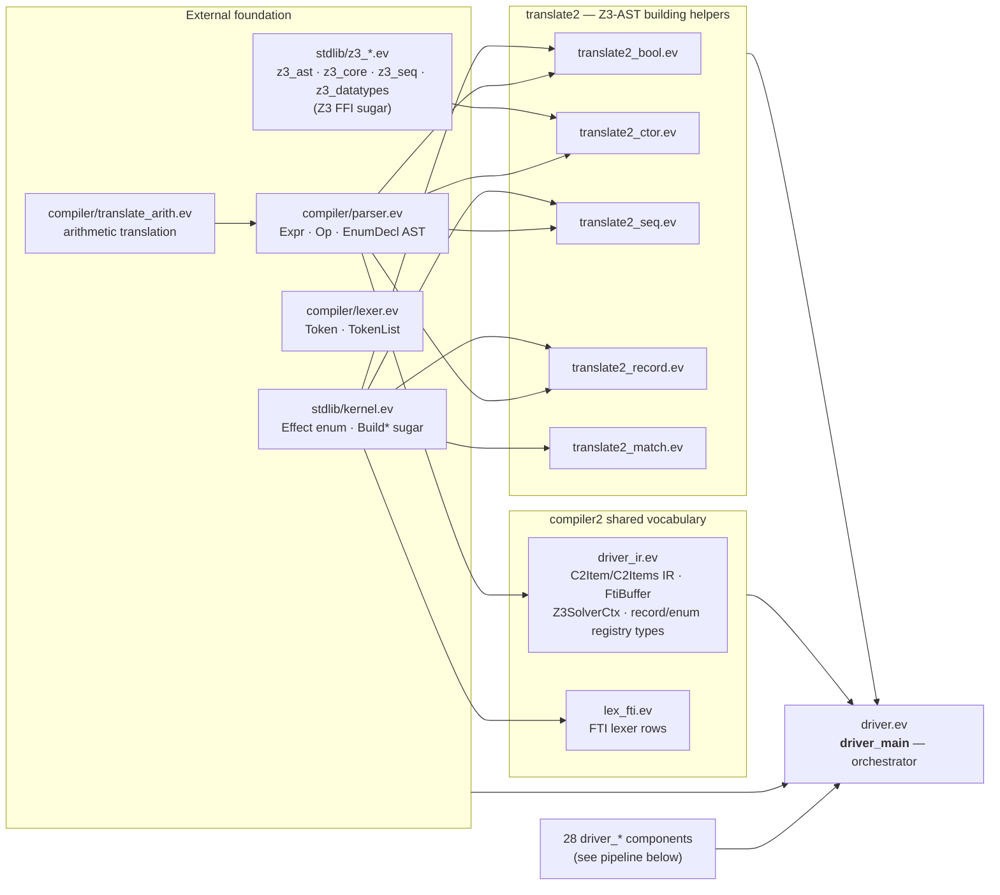
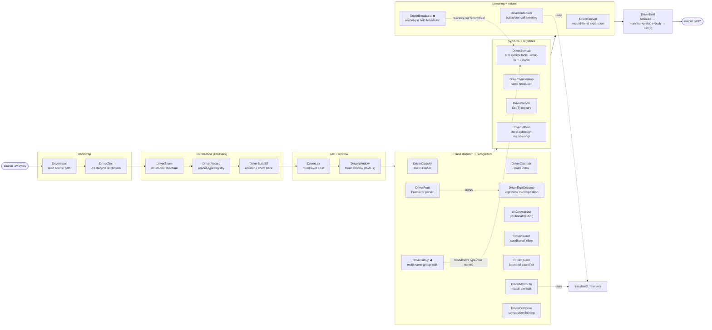
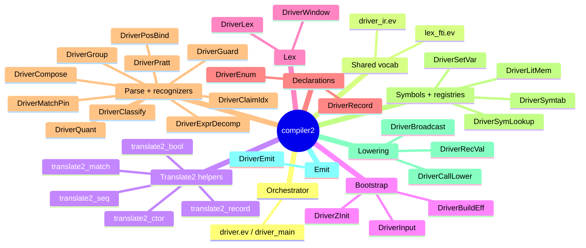

# compiler2 — dependency & composition tree

The self-hosted Evident compiler lives in `compiler2/*.ev`. This document
maps two distinct graphs:

1. **Import / flatten graph** — what `import "…"` pulls in (textual; how the
   single flattened translation unit is assembled).
2. **Composition pipeline** — how `driver_main` (in `driver.ev`) *composes*
   the ~28 components by names-match (`..`-lift or bare-mention). This is the
   real data-flow architecture; imports are just a flat star around it.

> Generated 2026-06-11 from the source tree. `driver.ev` is the hub: it
> imports every component, the translate2 helpers, the legacy `compiler/`
> foundation, and `stdlib/`. Components do **not** import each other — they
> are flattened together and join by shared variable names.

---

## 1. Layered import graph

`driver.ev` flattens all of the above into one unit; `driver_ir.ev` and the
`translate2_*` helpers depend only on the `compiler/parser.ev` AST + `stdlib`.
The legacy `compiler/` reach (`lexer`/`parser`/`translate_arith`) is the
`legacy_compiler_imports` goalpost (currently **3**, target 0 — deletable
once those types move into compiler2).

---

## 2. Composition pipeline (driver_main)

`driver_main` threads source → tokens → parse → work-items → Z3 effects →
emit. Each box is a component composed in this order. **Bare-mention**
components (encapsulated header interface) are marked `◆`; the rest are
`..`-lift (shared flat namespace).

### Phase / `parse_mode` key

The pipeline is a tick-driven FSM; `parse_mode` selects the active recognizer:

| `parse_mode` | Stage | Owner |
|---|---|---|
| phase 0 | lex | DriverLex |
| 0 / 1 / 2 | parse dispatch · skip · claim | driver_main |
| 3 | (emit phase) | DriverEmit |
| 6 | match-pin walk | DriverMatchPin |
| 7 / 8 | literal-collection membership | DriverLitMem |
| 9 | multi-name group walk | DriverGroup ◆ |
| 10 | composition inlining | DriverCompose |
| 12 | positional binding | DriverPosBind |
| 13 | record-decl | DriverRecord |

---

## 3. Components by role

---

## Notes

- **Composition is by names-match, not imports.** A component's interface is
  the set of variable names it shares with `driver_main`. `..`-lift exposes
  the whole body to the shared namespace; **bare-mention** (`◆`: DriverGroup,
  DriverBroadcast) hides internals behind a declared header — the encapsulation
  direction. See `docs/plans/claim-headers-interface.md`.
- **`driver_ir.ev` is the keystone type module** — the `C2Item`/`C2Items`
  work-item IR, `FtiBuffer`, `Z3SolverCtx`, and the record/enum/set registry
  types every component reads/writes.
- **The artifact** `compiler.smt2` is the compiled form of this tree; it is
  rebuilt only on the (blocked) wave-5 path. Source edits here are validated
  through the frozen oracle (conformance + units), not by rebuilding the
  artifact.
