# compiler2 — from broken dev loop to self-hosting

The end goal, the path walked over the last two days, and what
remains. Parallel branches in the chart were genuinely parallel
agent waves (isolated git worktrees, merged with test gates).

## The end goal

**Genuine self-hosting on the Z3-AST architecture**: the compiler is
an Evident program that builds the output *model* in Z3's memory via
`LibCall` effects (no SMT-LIB text construction, no string state),
with tokens and symbol tables in FTI (libc) memory, and Z3 itself
serializing the result. The loop closes when **compiler2 compiles
its own source**. On that day: the bootstrap oracle binary is
deleted (sunset clause in `scripts/build-oracle.sh`), the
fossil-lineage artifacts and the legacy text-rendering `compiler/`
tree retire, and `compiler2/` is renamed `compiler/`.

Why this architecture (operator decision, day 1): every Z3 op is
available by construction (no renderer to be incomplete — the
legacy `Exit(3+4)`-drops-args bug class cannot exist), no
escaping/string-growth pathologies (output is ONE Int handle), and
the per-node claim files are small (7 files / ~4.7k lines vs ~20
text-rendering files in legacy `compiler/`).

## The flowchart

```mermaid
flowchart TD

START["REPO 2 DAYS AGO
fossil artifacts (built by deleted bootstrap)
seam compiles: hours/OOM/never-terminate
153 GB RSS observed; '16 known-fails' lore
bootstrap deleted; rebuild loop broken"]

subgraph DAY1A["Day 1 — make the dev loop run at all (sequential)"
]
  MT["Diagnose tick-0 divergence:
  Z3 incremental core gets no preprocessing
  → Mech T: per-tick tactic solver
  (∞ → 18 min compiles)"]
  FZ["Functionizer covers compiler.smt2
  (5 fixes: recognizer decl-params, XOR capture,
  carry seeding, guard trees, prev_results)
  18 min → 35 s, byte-identical emits"]
  ENV["Container fixes: Z3 4.8.12→4.15.4 baked
  into image; c_char build fix; EVIDENT_PHASE_TRACE;
  parallel conformance runner; honest census 14/138"]
  MT --> FZ --> ENV
end

START --> DAY1A

subgraph WAVE1["Day 1 — parallel fleet (worktrees)"]
  P0["P0: fossil-subset probe
  71 fixtures → subset map"]
  S1["S1: z3_core sugar
  18 claims + proof"]
  S2["S2: z3_ops sugar
  17 claims + proof"]
  S3["S3: z3_seq sugar
  16 claims + 2 proofs"]
  S4["S4: z3_datatypes sugar
  datatype roundtrip proven"]
  SPIKE["stage-0 sizing spike
  stitch toy RUNS (fallback proven,
  800-1k lines projected)"]
end

DAY1A --> WAVE1

ORACLE["OPERATOR DECISION: bootstrap oracle
build once from pinned history (c218dca^),
keep ONLY the binary, sunset on self-compile
→ full-language Evident→smt2 in seconds"]

WAVE1 --> ORACLE

PROMO["Artifacts regenerated via oracle + promoted
compiler.smt2 (census-identical = regression-clean)
sample.smt2 (expr-slot-binding port VERIFIED live)"]

ORACLE --> PROMO

subgraph WAVE2["Day 2 — P2: five parallel translate-pass agents"]
  T1["translate2_bool
  cmp/nary/not/ite"]
  T2["translate2_record
  field/literal/eq-lift"]
  T3["translate2_seq
  literals/select/str ops"]
  T4["translate2_ctor
  enum-decl steps; (B (+ 3 4))→'(B 7)'"]
  T5["translate2_match
  testers/arm-fold/accessors"]
end

PROMO --> WAVE2

P3A["P3a: driver skeleton
lex→parse→walk→libcalls→solver_to_string
FIRST CENSUS BLOOD: 026 + 008 (2)"]

WAVE2 --> P3A
P3A --> P3B["P3b: widen shapes
memberships/comparisons/implies (+16 → 18)"]

subgraph WAVE3["parallel"]
  P3C["P3c: Pratt parser FSM
  replaces shape zoo (+4 → 22)"]
  FTIL["FTI lexer spike
  token_stack proven standalone"]
end

P3B --> WAVE3
WAVE3 --> P3D["P3d: FTI lexer wired into driver
22/22 held, unbounded TokenList pins gone"]

subgraph NIGHT["Overnight autonomous loop (serial driver waves + parallel triage)"]
  P3E["P3e: user enums + full Effect floor
  (+4 → 26; units that PRINT)"]
  PERF["kernel: bare-Bool-literal capture
  driver compiles 283 s → 11 s (26×)
  (from parallel read-only diagnosis agent)"]
  A12["A1+A2: lexer digit-idents + escapes
  oracle-exact; corpus gate cleared"]
  B12["B1+B2: FTI symtab (corpus-scale,
  3 state fields) + String state (+1 → 27)"]
  B3["B3: string ops + Pratt call syntax
  (+11 → 38)"]
  D3C2["D3+C2: last_results select + Result floor
  + set literals (+4 → 41; ahead of fossil)"]
  C34["C3+C4: ctor apps (compound args!) +
  matches + n-arm match (006 flips → 42)"]
  TRIAGE["parallel triage closures:
  #20 verdict bug = pre-existing (fossil A/B)
  #21 phase-5 wedge → runner timeouts/streaming
  honest kernel-fixture baseline 2/119"]
  P3E --> A12 --> B12 --> B3 --> D3C2 --> C34
end

P3D --> NIGHT

C5D2["C5+D2 (RUNNING NOW):
match payload binds + expr arm bodies
+ conditional effects literals"]

NIGHT --> C5D2

E1F1["E1: carries/manifest floor
F1: first-line param lists"]
F2["F2: claim compositions
(325 corpus sites — the big one;
prior art: parse_body_call.ev/SlotSubst)"]

C5D2 --> E1F1 --> F2

SAMPLE["MILESTONE: compiler2 compiles
compiler/sample.ev — diffed against the
oracle's emit of the same source"]

F2 --> SAMPLE

CORPUS["widen against the kernel-fixture corpus
(honest baseline 2/119) + functionizer/JIT
coverage for speed"]

SAMPLE --> CORPUS

SELF["compiler2 compiles compiler2
(driver.ev + passes + lexer through itself)"]

CORPUS --> SELF

GOAL["END GOAL: SELF-HOSTING
delete oracle (sunset clause)
retire fossil artifacts + legacy compiler/
rename compiler2/ → compiler/"]

SELF --> GOAL

style START fill:#fdd
style GOAL fill:#dfd
style ORACLE fill:#ffd
style SAMPLE fill:#ddf
style SELF fill:#ddf
```

## How the pieces serve the goal

| layer | what it is | why the goal needs it |
|---|---|---|
| kernel (Rust, frozen) | trampoline + libffi + Z3 + functionizer | the only native runtime; everything else is Evident |
| `stdlib/z3_*.ev` (~60 claims) | one `LibCall` wrapper per Z3 C function | the vocabulary compiler2 speaks |
| `compiler2/translate2_*.ev` (5 files) | per-node "which libcall builds this" claims | the entire translation semantics — no text |
| `compiler2/lex_fti.ev` | tokens in libc memory, 5 Ints of state | FTI input side (operator design); no string state-carry |
| `compiler2/driver.ev` | the FSM: read → lex → Pratt parse → walk → emit | where census widening lands; absorbs the work |
| bootstrap oracle (binary only) | full-language Evident→smt2, seconds | scaffolding that builds compiler2 until self-compile; then deleted |
| census + fixture corpora | 138 conformance + 119 kernel fixtures, honest baselines | the scoreboard: 14/138 legacy vs 42 and counting for compiler2 |

## Score as of this writing

compiler2: **42 conformance fixtures** compile AND run correctly
(legacy artifact: 14), at ~11 s/compile, with every wave holding the
full prior regression suite. Remaining before the sample.ev
milestone: C5+D2 (in flight), E1, F1, F2.
