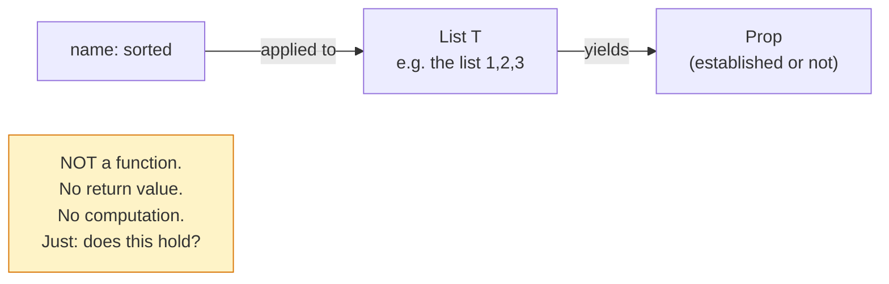
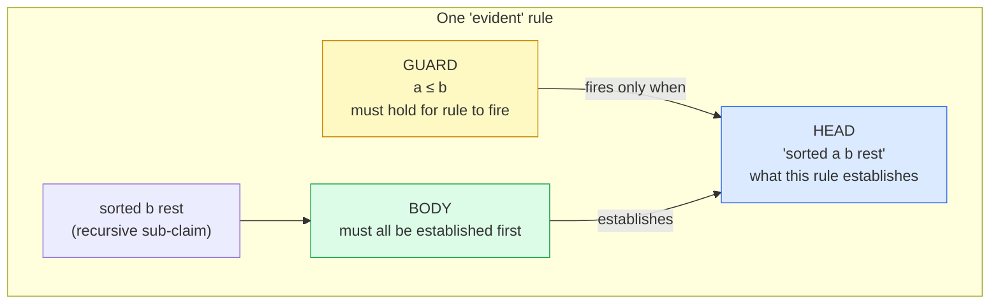
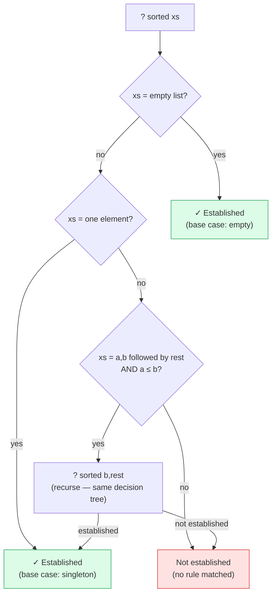
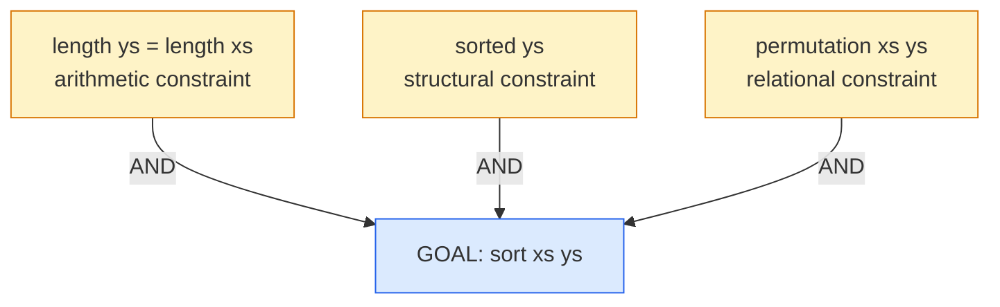
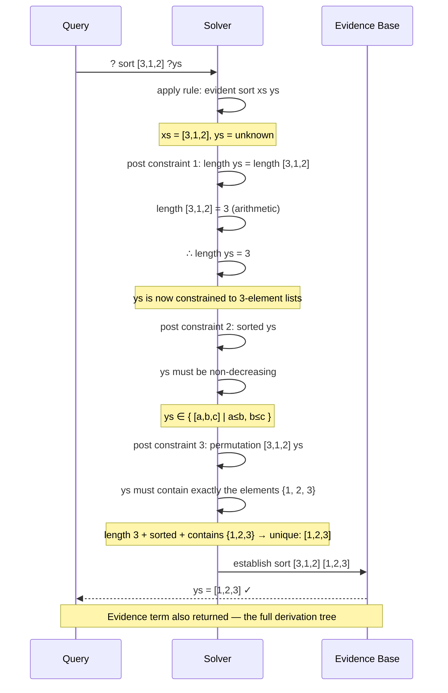
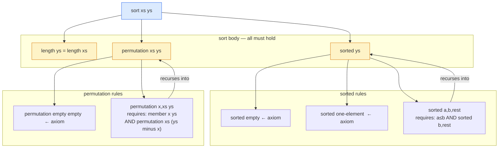

# How Claims and Evidence Become a Constraint System

Using `sorted` and `sort` as the working example.

---

## 1. What a `claim` declaration is

```evident
claim sorted[T : Ordered] : List T -> Prop
```

A `claim` is a **relation schema**, not a function. It declares that `sorted` is a name
that can be *established* or *not established* for a given argument. `Prop` means it
produces a truth value, not a computed value. There is no "return."



Compare to a function: `sorted [1,2,3]` would *return* `true`. In Evident, `sorted [1,2,3]`
is either *derivable from the rules* or it isn't. The distinction matters because the solver
can work backwards — asking "what list would make `sorted ?xs` hold?"

---

## 2. What an `evident` block is

Each `evident` block is one **conditional rule**: if the body sub-claims are all established,
the head becomes established.

```evident
evident sorted [a, b | rest] when a <= b
    sorted [b | rest]
```



Reading it as a **constraint on the solver**: to establish `sorted [a, b | rest]`, the
solver must find values for a, b, rest such that `a <= b` holds AND `sorted [b | rest]`
is established. If no such values exist, the rule cannot fire.

---

## 3. All rules for `sorted` together — a decision procedure

```evident
evident sorted []
evident sorted [_]
evident sorted [a, b | rest] when a <= b
    sorted [b | rest]
```

The three rules together form a complete decision procedure. The solver tries each:



No ordering between the three rules — the solver can try them in any order. Only one
can succeed for any given list. (The guards and patterns make them mutually exclusive.)

---

## 4. `sort` as a constraint conjunction

```evident
claim sort[T : Ordered] : List T -> List T -> Prop

evident sort xs ys
    length ys = length xs
    sorted ys
    permutation xs ys
```

The body is a **simultaneous conjunction of constraints**. To establish `sort xs ys`,
ALL THREE must hold at the same time. The solver must find values for any unbound
variables (like `ys` in a query) that satisfy all three together.



This is where the constraint solver earns its keep. With `xs = [3, 1, 2]`:

- C1 alone says: ys has length 3
- C1 + C2 say: ys is a sorted list of length 3 (e.g. `[0,0,0]` would qualify)
- C1 + C2 + C3 say: ys is a sorted list of length 3 containing exactly {1, 2, 3}

Only one list satisfies all three. The solver finds it.

---

## 5. Solver trace: `? sort [3, 1, 2] ?ys`



The key step: constraints 1, 2, and 3 **propagate** to narrow the space of possible `ys`
values until only one remains. The solver never tried any permutation explicitly — the
constraints ruled everything else out.

---

## 6. The full dependency graph

How `sort` depends on `sorted` and `permutation`, which depend on further sub-claims:



Each node is a claim. Each edge is "requires." The solver walks down from the query,
posting constraints at each level, propagating their consequences upward until the top-level
claim is established.

---

## What the programmer's job actually is

| | Conventional programming | Evident |
|---|---|---|
| You write | An algorithm (steps to execute) | A model (conditions that must hold) |
| Variables | Storage locations (assigned, mutated) | Unknowns (constrained, resolved) |
| A "call" | Execute this computation | Check / establish this claim |
| Body lines | Instructions in sequence | Constraints that must all hold simultaneously |
| Order matters? | Yes — sequence is the program | No — the solver finds any valid order |
| Output | Return value | Established fact + evidence term |

The `claim` line says: **this is the shape of a fact that can be established.**

The `evident` line(s) say: **here are the conditions under which that fact is established.**

The solver says: **given a query, find values that make all conditions true simultaneously.**

You are not telling the computer *how* to sort. You are telling it *what sorted means*,
and it figures out how to get there.
