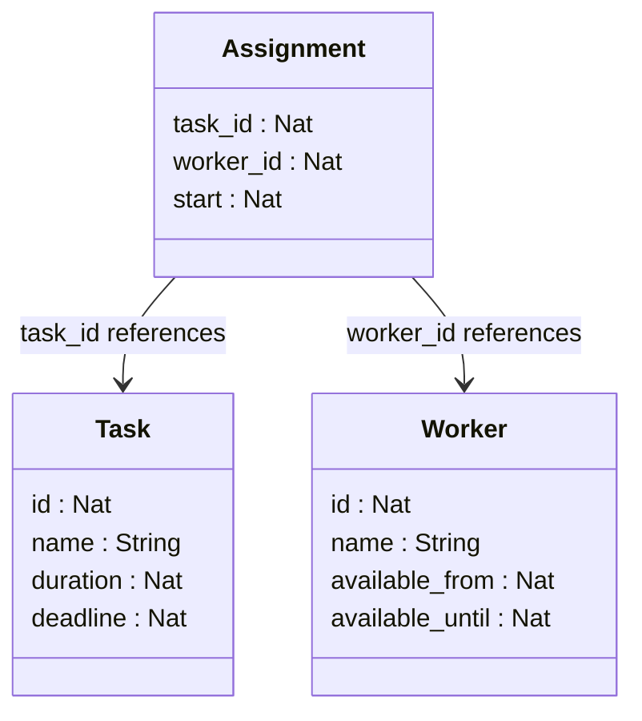
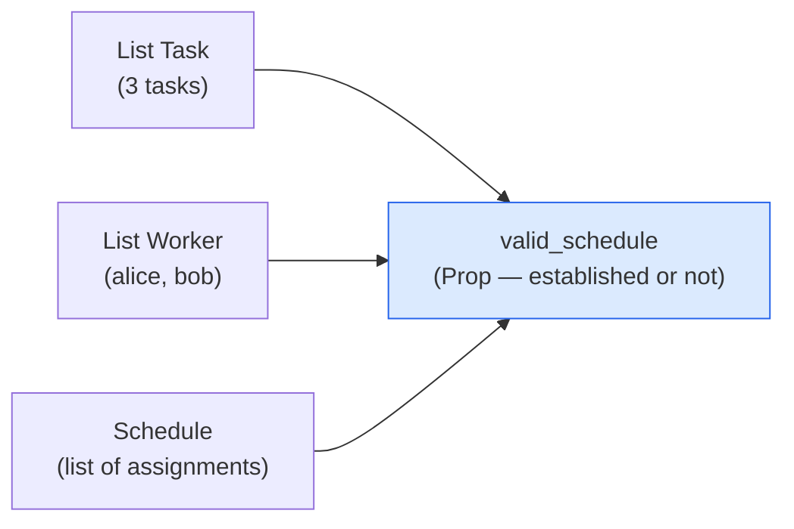
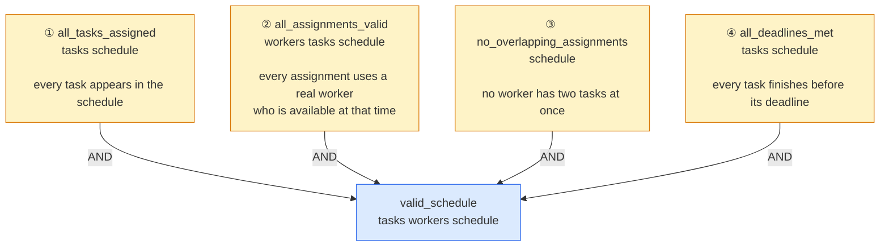
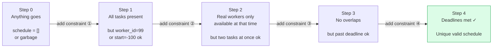
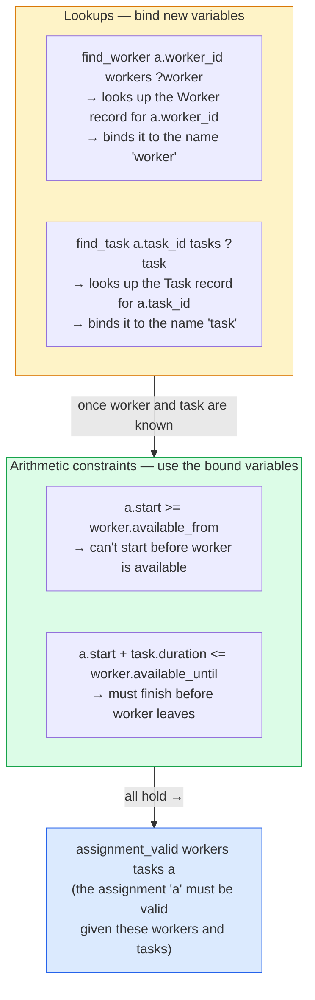
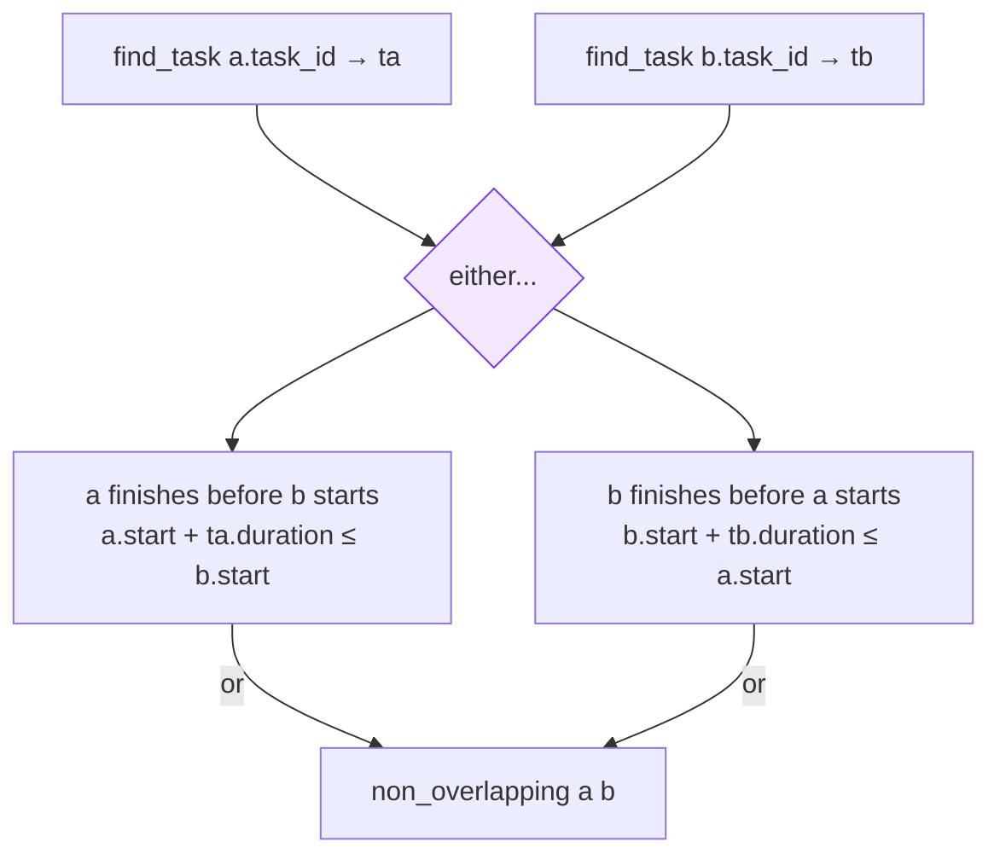
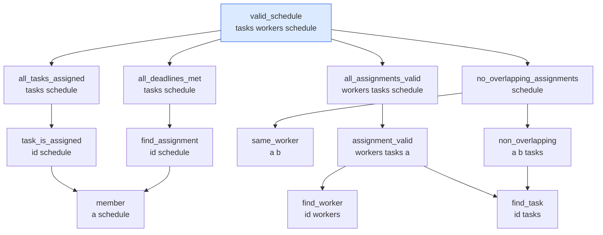
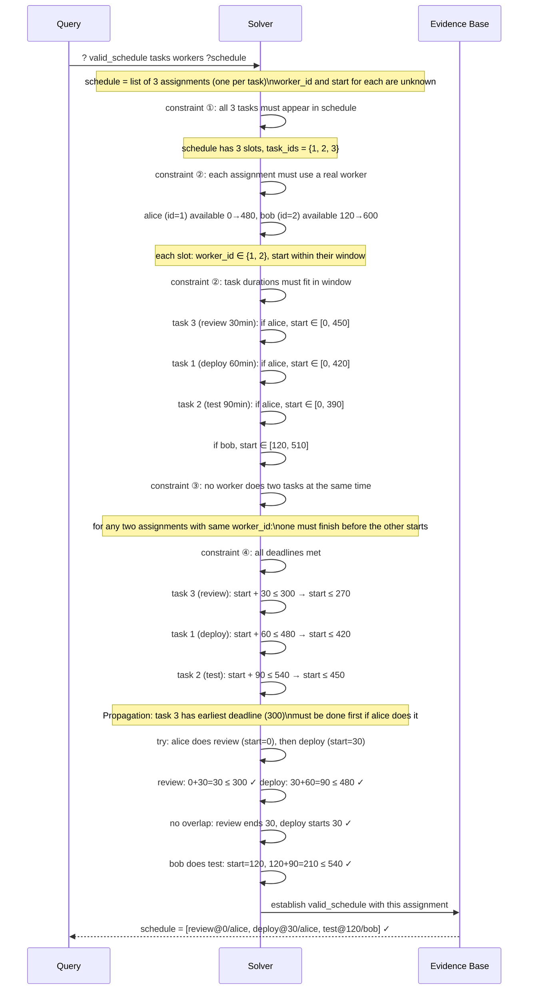
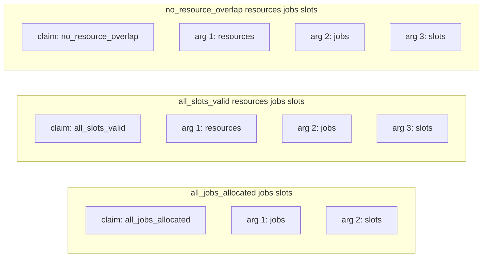

# How the Scheduling Example Works

A visual breakdown of `valid_schedule` — the claim the user had trouble reading.

---

## The data being scheduled

Three tasks, two workers. Concrete numbers throughout.



In our example:

| Task id | name | duration | deadline |
|---------|------|----------|----------|
| 1 | deploy | 60 min | by min 480 |
| 2 | test | 90 min | by min 540 |
| 3 | review | 30 min | by min 300 |

| Worker id | name | available |
|-----------|------|-----------|
| 1 | alice | min 0 → 480 |
| 2 | bob | min 120 → 600 |

A `Schedule` is just a list of `Assignment` records — each one says which worker does which task starting when.

---

## What `valid_schedule` is

```evident
claim valid_schedule : List Task -> List Worker -> Schedule -> Prop
```

`valid_schedule` is a **3-place relation**. It is established (true) when a given schedule
is valid for a given set of tasks and workers. It doesn't produce a schedule — it checks
(or constrains) one.



When we query `? valid_schedule tasks workers ?schedule`, the solver must find a value
for `?schedule` that makes the claim true.

---

## The four constraints — built up one at a time

`valid_schedule` is eventually defined by four simultaneous constraints:



What the solver is allowed to produce grows more constrained at each step:



---

## Unpacking constraint ② — the hardest one to read

The body of `assignment_valid` was the specific code the user found confusing:

```evident
evident assignment_valid workers tasks a
    find_worker a.worker_id workers ?worker
    find_task   a.task_id   tasks   ?task
    a.start >= worker.available_from
    a.start + task.duration <= worker.available_until
```

There are **two kinds of lines** mixed together here. Let's label them:



Concretely, for assignment `{ task_id=1, worker_id=1, start=30 }`:

| Line | What happens |
|------|-------------|
| `find_worker 1 workers ?worker` | finds `{ id=1, name="alice", available_from=0, available_until=480 }` |
| `find_task 1 tasks ?task` | finds `{ id=1, name="deploy", duration=60, deadline=480 }` |
| `30 >= 0` | alice is available at minute 30 ✓ |
| `30 + 60 <= 480` | deploy finishes at 90, alice is there until 480 ✓ |

---

## Constraint ③ — what "no overlap" means

```evident
evident non_overlapping a b tasks
    find_task a.task_id tasks ?ta
    find_task b.task_id tasks ?tb
    a.start + ta.duration <= b.start
        | b.start + tb.duration <= a.start
```

The `|` is disjunction: one OR the other must hold.



For alice doing deploy (start=30, duration=60) and alice doing review (start=0, duration=30):
- Does review finish before deploy starts? `0 + 30 = 30 <= 30` ✓ Yes — no overlap.

For alice doing deploy (start=0) and alice doing test (start=0):
- Does deploy finish before test? `0 + 60 = 60 <= 0`? No.
- Does test finish before deploy? `0 + 90 = 90 <= 0`? No.
- Neither holds → overlap → constraint fails.

---

## The full claim dependency tree



Every box is a `claim`. Every arrow is "requires." The solver walks this tree, posting
constraints at each node, propagating values upward until `valid_schedule` is established.

---

## What the solver actually does — with real numbers

The solver's job is to find values of `?schedule` (specifically, the `start` time in each
assignment and which worker does which task) satisfying all constraints simultaneously.



---

## The valid schedule as a timeline

```mermaid
gantt
    title Valid Schedule (time in minutes from 00:00)
    dateFormat  X
    axisFormat  %s min

    section Alice
    review  (task 3) :done, 0, 30
    deploy  (task 1) :done, 30, 90

    section Bob
    test    (task 2) :done, 120, 210
```



Deadlines (for reference): review by 300, deploy by 480, test by 540. All met.

---

## Why the body lines are hard to read — and what they actually say

The specific block the user found confusing:

```evident
evident valid_allocation jobs resources slots
    all_jobs_allocated jobs slots
    all_slots_valid resources jobs slots
    no_resource_overlap resources jobs slots
    all_jobs_on_time jobs slots
```

Each line is: **claim-name  arg1  arg2  ...**

The hidden structure:



What's not visible in the syntax:
- Which token is the claim name vs. which are arguments
- What role each argument plays (is `resources` the thing being checked, or the context?)
- Why `resources` appears in lines 2 and 3 but not line 1

This is the readability gap the language design needs to close.
The diagrams above make the structure visible. The syntax currently does not.
