# Lint framework

Mechanical and agent-driven code reviews against a shared rulebook.

## Runtime dependency graph

What each `runtime/src/` file imports from other `runtime/src/`
files, grouped by concern. Solid arrows are real `use crate::*`
or `use super::*` imports; dotted arrows are cross-language
contracts (the file's correctness depends on a `.ev` file's
shape, even if there's no Rust import). Edges from `lib.rs` to
internal modules are omitted — `lib.rs` re-exports almost
everything, and showing 12 fan-out lines obscures the structural
shape.

```mermaid
graph TD
    %% Frontend
    subgraph FE [Frontend]
        ast[ast.rs]
        lexer[lexer.rs]
        parser[parser.rs]
        pretty[pretty.rs]
    end

    %% Translation
    subgraph TR [Translation]
        translate[translate.rs<br/>mod]
        types[translate/types.rs]
        datatypes[translate/datatypes.rs]
        declare[translate/declare.rs]
        preprocess[translate/preprocess.rs]
        exprs[translate/exprs.rs]
        inline[translate/inline.rs]
        extract[translate/extract.rs]
        eval[translate/eval.rs]
        encode_ast[translate/encode_ast.rs]
        decode_ast[translate/decode_ast.rs]
    end

    %% Runtime API
    subgraph RT [Runtime API]
        runtime[runtime.rs]
        subscriptions[subscriptions.rs]
    end

    %% Execution
    subgraph EX [Execution]
        effect_loop[effect_loop.rs]
        effect_dispatch[effect_dispatch.rs]
    end

    %% FFI / FTI / Bridges
    subgraph FF [FFI / FTI / Bridges]
        ffi[ffi.rs]
        fti[fti.rs]
        event_sources[event_sources.rs<br/>pending split]
    end

    %% CLI
    subgraph CLI [CLI commands]
        cmd_common[commands/common.rs]
        cmd_check[commands/check.rs]
        cmd_query[commands/query.rs]
        cmd_sample[commands/sample.rs]
        cmd_test[commands/test.rs]
        cmd_effect_run[commands/effect_run.rs]
        cmd_lint[commands/lint.rs]
        cmd_desugar[commands/desugar.rs]
        cmd_infer_types[commands/infer_types.rs]
    end

    %% Top-level
    subgraph TOP [Top-level]
        lib[lib.rs<br/>re-exports]
        main[main.rs<br/>arg dispatch]
    end

    %% Cross-language contracts (dotted)
    stdlib_runtime>stdlib/runtime.ev]
    stdlib_ast>stdlib/ast.ev]
    fti -.cross-lang.-> stdlib_runtime
    encode_ast -.cross-lang.-> stdlib_ast
    decode_ast -.cross-lang.-> stdlib_ast

    %% Frontend
    parser --> ast
    parser --> lexer
    pretty --> ast

    %% Translation internals
    datatypes --> types
    datatypes --> ast
    declare --> types
    declare --> datatypes
    declare --> ast
    preprocess --> types
    preprocess --> exprs
    preprocess --> ast
    exprs --> types
    exprs --> preprocess
    exprs --> ast
    inline --> types
    inline --> declare
    inline --> exprs
    inline --> ast
    inline --> pretty
    extract --> types
    eval --> types
    eval --> declare
    eval --> inline
    eval --> exprs
    eval --> extract
    eval --> preprocess
    eval --> ast
    encode_ast --> types
    encode_ast --> ast
    decode_ast --> types
    decode_ast --> ast
    translate --> eval

    %% Runtime API
    runtime --> ast
    runtime --> parser
    runtime --> translate
    subscriptions --> ast

    %% Execution
    effect_loop --> ast
    effect_loop --> effect_dispatch
    effect_loop --> runtime
    effect_loop --> translate
    effect_loop --> event_sources
    effect_loop --> fti
    effect_dispatch --> ast
    effect_dispatch --> ffi

    %% FFI / FTI / Bridges
    fti --> ast
    fti --> event_sources

    %% CLI — every cmd_* uses common; main dispatches to each
    cmd_check --> cmd_common
    cmd_query --> cmd_common
    cmd_sample --> cmd_common
    cmd_test --> cmd_common
    cmd_check --> runtime
    cmd_query --> runtime
    cmd_sample --> runtime
    cmd_test --> runtime
    cmd_effect_run --> runtime
    cmd_effect_run --> effect_loop
    cmd_lint --> runtime
    cmd_desugar --> runtime
    cmd_desugar --> ast
    cmd_infer_types --> runtime
    cmd_infer_types --> ast
    cmd_test --> pretty
    main --> cmd_check
    main --> cmd_query
    main --> cmd_sample
    main --> cmd_test
    main --> cmd_effect_run
    main --> cmd_lint

    %% Highlight the known cycle (preprocess ↔ exprs)
    classDef cycle fill:#ffe0e0,stroke:#c00,stroke-width:2px
    class preprocess,exprs cycle

    %% Highlight the known split-pending file
    classDef pending fill:#fff4cc,stroke:#a80,stroke-width:2px
    class event_sources pending

    %% Cross-language contract nodes
    classDef stdlib fill:#e0e8ff,stroke:#04a,stroke-width:1px
    class stdlib_runtime,stdlib_ast stdlib
```



Notes on the diagram:

- **Red nodes** (`preprocess`, `exprs`): the known dependency cycle.
  `preprocess` imports `exprs::translate_int` for literal folding;
  `exprs` imports `preprocess::env_clone, literal_range` for env
  utilities. The invariant in `runtime-invariants.md` forbids the
  cycle — fixing means moving the shared helpers down to
  `types.rs`.
- **Yellow node** (`event_sources`): currently one 1390-line file
  with 9 distinct bridges; the invariant treats it as if it were
  already split into `event_sources/<name>.rs`. The split is
  pending.
- **Blue dotted nodes** (`stdlib/runtime.ev`, `stdlib/ast.ev`):
  Evident-side files with cross-language coupling to specific
  Rust files. `fti.rs::INSTALLERS` must mirror the `type X`
  declarations in `stdlib/runtime.ev`. `encode_ast.rs` and
  `decode_ast.rs` must mirror the enum / record shape in
  `stdlib/ast.ev`. Drift = runtime failure.
- **`lib.rs` arrows omitted** for readability. It re-exports
  every internal `pub mod`; showing those arrows would clutter
  without adding structural information.
- **`main.rs` only depends on `commands/`** — the binary entry
  is a thin dispatcher.

```
lints/
  README.md              this file
  agent-prompt.md        the brief for the code-review subagent
  rules/                 the rulebook — one markdown per anti-pattern
    AP-NNN-<name>.md
  checks.sh              mechanical runner; loads active rules,
                         applies their grep patterns, exits non-zero
                         on violation. Wired into test.sh as Phase 0.
  findings/              where agent runs deposit per-file reports.
                         Reviewed by humans; deletable once acted on.

runtime/tests/lints.rs   AST-based rules that need a real parser
                         (cross-file invariants, structural checks)
```

## How a rule is born

Two paths, same shape:

1. **Human or agent observes a recurring mistake.** They write a new
   `lints/rules/AP-NNN-<short-name>.md` describing it, then add the
   detection to `checks.sh` (grep) or `runtime/tests/lints.rs` (AST).
   Run `./test.sh --lints-only` to confirm the check fires on the
   offending file. Optionally fix existing offenders or document
   them as known violations.

2. **Code-review subagent surfaces a candidate pattern.** When run
   on a file, the agent reports findings in `lints/findings/`. If
   it spots something that looks like a real anti-pattern (not a
   one-off issue), it proposes a new rule by writing the rule file
   and editing `checks.sh`. Human reviews + commits or rejects.

## Rule file format

Every file in `lints/rules/` follows this template so both humans
and the agent can read/write them:

```markdown
# AP-NNN: <short-name>

**Status:** active | proposed | warn-only

**Pattern.** What to look for in concrete terms — symbol, syntax
shape, file location.

**Why.** Why it's bad. Cite a real past mistake if you have one.

**Fix.** What to do instead.

**Detection.** grep | ast | review-only

**Pattern (grep).** A regex literal, or a description if review-only.

**Scope.** Which paths the rule applies to (whitelist / blacklist).

**Exceptions.** Cases where a violation is acceptable (e.g.,
strings inside comments don't count).

**Examples.**
  - Past commit / file-line where this bit us.
  - The seed entries in this directory cite the SdlVertex
    intrusion in `ast.rs`, the inline `LibCall` in
    `examples/test_16_sdl_red.ev`'s first draft, etc.
```

## How `checks.sh` works

Each active rule has a corresponding shell function in `checks.sh`
named `check_<short-name>`. The runner enumerates these functions,
runs them, prints a per-rule pass/fail line, and exits 1 if any
failed. New rule = new function in `checks.sh` (it's not auto-loaded
from the rule file because grep patterns benefit from being
hand-tuned, and we want each check to be runnable / debuggable on
its own).

The `lints/rules/AP-NNN-*.md` file is the prose; the `check_*`
function in `checks.sh` is the executable form. Convention: the
shell function's first comment line cites the rule by ID.

## How the code-review agent runs

The agent's standing brief lives in `lints/agent-prompt.md`. To run
a review, an outer agent (typically Claude in an interactive
session) launches a subagent with that prompt + the file(s) to
review. The subagent:

1. Reads `lints/rules/` to learn the active rulebook.
2. Reads the assigned file.
3. Writes findings to `lints/findings/<basename-of-file>.md` in a
   fixed format (see agent-prompt.md).
4. If it identifies a new anti-pattern, writes a new rule file under
   `lints/rules/` AND adds a `check_*` function to `checks.sh`.
5. Reports back a brief summary.

Findings accumulate. A human (or the outer agent) walks them, fixes
or dismisses each, and deletes the corresponding `lints/findings/`
file when done.
