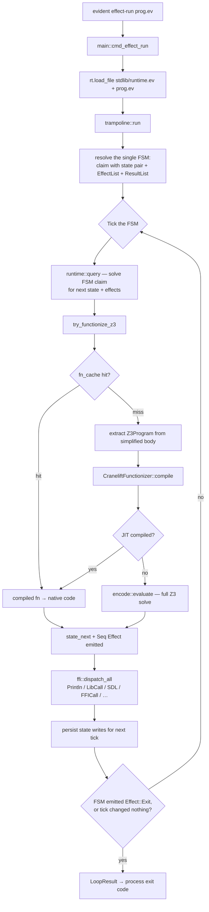

# `runtime/` — Evident, Rust implementation

The Rust runtime is the only implementation of Evident. The language is
defined by what this crate parses, encodes to Z3, and executes.

What ships:
- A constraint-solver façade — `EvidentRuntime` with `load_file`, `query`,
  `query_cached`, `sample` — backed by Z3.
- A single-FSM run loop (`trampoline.rs`) that runs `evident effect-run …`
  programs: it ticks one FSM over a state store.
- A JIT functionizer (`functionize/`) that compiles extracted `Z3Program`s
  to native code via Cranelift. JIT misses fall through to a full Z3 solve.
- FFI / FTI bridges (`ffi.rs`) so programs can reach SDL, the wall clock,
  etc. — and typed OS resources via the declarative-install bridge.
- A CLI binary (`main.rs`) exposing `test` and `effect-run`.

## Quick start

```sh
cargo build --release                              # build the crate + binary
./test.sh                                          # run all tests (~10s warm)
./runtime/target/release/evident effect-run X.ev   # run an effect program
```

Tests: `./test.sh` from the repo root builds release + runs Rust units +
integration tests + the demo driver. `--examples` / `--examples-only`
for the end-to-end demo subsets.

Z3 is required. On macOS: `brew install z3`.

## Source layout

Single-concern modules under `runtime/src/`. The full "want to change X →
edit file Y" table lives in [`../CLAUDE.md`](../CLAUDE.md#source-layout-which-file-owns-what).
Top-level summary:

| Module | Purpose |
|---|---|
| `core/`          | Shared data types (Evident AST in `ast.rs`; `Value`, `Z3Program`, `EnumRegistry`, `QueryResult`, `RuntimeError`, Seq helpers in `types.rs`). Imported by everything. No orchestration logic. |
| `runtime/`       | `EvidentRuntime`: load, query, sample, run-loop-facing API (`mod.rs`, `query.rs`, `lower.rs`, `register_enums.rs`) |
| `trampoline.rs`  | The run loop — `run` / `run_with_ctx`, FSM discovery, per-tick loop, effect ordering |
| `encode/`        | Evident AST → Z3 ASTs; build solvers; extract models (`declare.rs`, `eval.rs`, `extract.rs`, `effect_codec.rs`, `exprs/`, `inline/`) |
| `functionize/`   | Functionizer (Cranelift JIT) + `extract_program.rs` (Z3 AST → `Z3Program`) |
| `ffi.rs`         | Effect → IO (Println, LibCall, FFICall, …); libffi marshaling + handle registry; FTI shimmed-stdlib check |
| `parser/`, `lexer.rs` | Front end (AST Display lives in `core/ast.rs`) |
| `main.rs`        | CLI binary: `test` / `effect-run` entry points |

Run `scripts/rust-size.py --per-file` for the current line-count table.
Target: ≤ 500 lines per file.

## Architecture

Two layers: a **core** of shared data types with no orchestration logic
(`core/`), and an **application stack** of subsystems built on top of it.
Every application module depends on `core::*`.

Reading order if you're new: `core/` (the vocabulary) → `parser/` →
`encode/` (the inline → eval pipeline) → `functionize/extract_program.rs`
(program extraction) → `functionize/` (program → native code) →
`runtime/` (the façade) → `trampoline.rs` (how the run loop drives it).

## `evident effect-run` flow

What happens when you type `evident effect-run prog.ev`:



The loop ticks one FSM: read the previous tick's state, solve the FSM
claim for the next state + its effects, dispatch the effects as real IO,
persist the writes, and bounce again. It halts when a tick changes
nothing (nothing more can happen) or the FSM emits `Effect::Exit(code)`.

Key files for each step (so you can read the code in order):

| Step | File:fn |
|---|---|
| CLI dispatch | `runtime/src/main.rs:cmd_effect_run` |
| Load + import resolution | `runtime/src/runtime/mod.rs` (load) |
| FSM discovery | `runtime/src/trampoline.rs:resolve_fsm` / `single_fsm` |
| Run-loop entry | `runtime/src/trampoline.rs:run_with_ctx` |
| Per-tick loop | `runtime/src/trampoline.rs:run_loop` |
| Effect ordering | `runtime/src/trampoline.rs:collect_dispatchable_effects` + `topo_sort_with_random_tiebreak` |
| Functionize / JIT path | `runtime/src/runtime/query.rs:try_functionize_z3` |
| JIT codegen | `runtime/src/functionize/cranelift/codegen.rs` |
| Z3Program extraction | `runtime/src/functionize/extract_program.rs` |
| Slow-path Z3 solve | `runtime/src/encode/eval.rs:evaluate` |
| Effect dispatch | `runtime/src/ffi.rs:dispatch_all` |
| Declarative install (FTI bridges) | `runtime/src/trampoline.rs:run_declarative_install` |

## Functionizer strategy

The runtime holds a `CraneliftFunctionizer` (`functionize/cranelift/`)
that compiles an extracted `Z3Program` to native code. JIT misses fall
through to a full Z3 solve via `encode::evaluate` — no intermediate
fallback layers.

## CLI

```sh
evident test        [path] [-v] [--no-color]   # walks for test_*.ev, runs sat_/unsat_ claims
evident effect-run  <file> [--max-steps N]     # run an effect-driven program
```

Output:
- `test` → `PASS|FAIL  <name>` per claim, plus a final summary
- `effect-run` → process exit code from `Effect::Exit(N)`, else 0 on clean
  halt, non-zero if it didn't halt cleanly within `--max-steps`

## Where to read first

1. [`../CLAUDE.md`](../CLAUDE.md) — language conventions and the
   source-layout lookup table.
2. [`../docs/design/schema-interface.md`](../docs/design/schema-interface.md)
   — the unifying framing of what an Evident model IS.
3. [`../docs/design/minimal-runtime.md`](../docs/design/minimal-runtime.md)
   — architectural goals (~11K Rust target, FFI-first).
4. `runtime/src/lib.rs` — module manifest; everything starts there.
