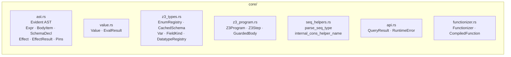
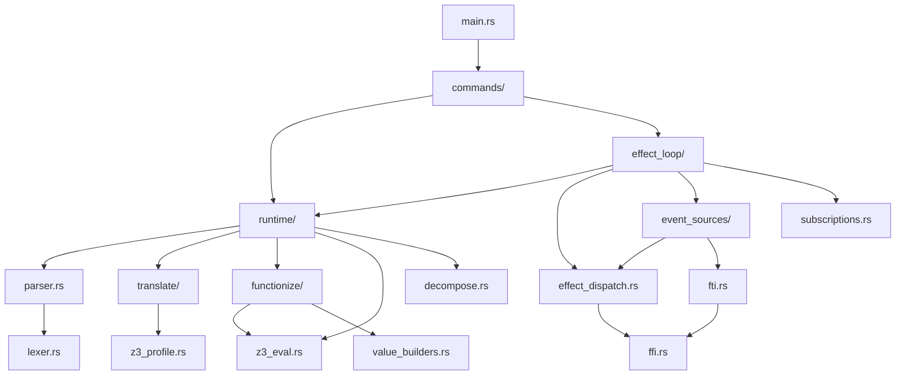
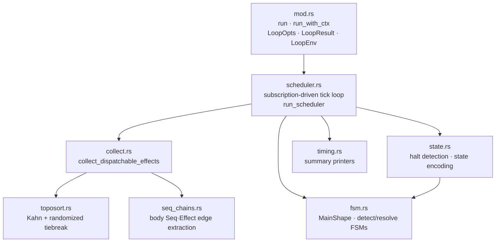
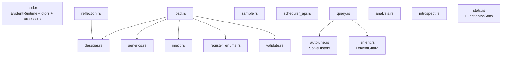
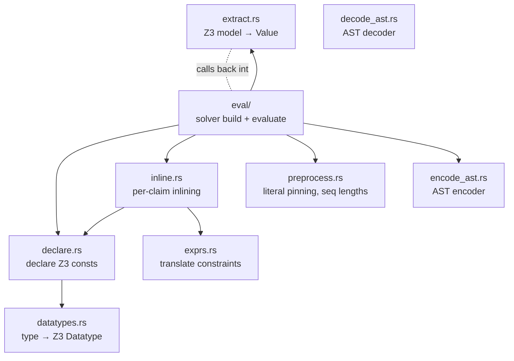
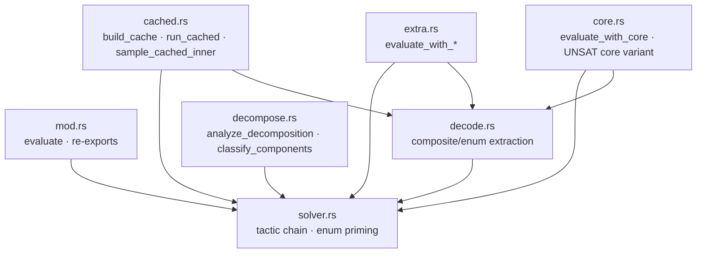
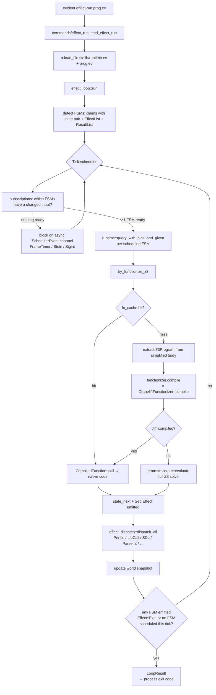

# `runtime/` — Evident, Rust implementation

The Rust runtime is the only implementation of Evident. The language is
defined by what this crate parses, translates to Z3, and executes.

What ships:
- A constraint-solver façade — `EvidentRuntime` with `load_file`, `query`,
  `query_cached`, `sample` — backed by Z3.
- A multi-FSM scheduler (`effect_loop`) that runs `evident effect-run …`
  programs.
- A JIT functionizer (`functionize`) that compiles extracted `Z3Program`s
  to native code via Cranelift. JIT misses fall through to a full Z3 solve.
- FFI / FTI bridges (`ffi.rs`, `fti.rs`, `event_sources/`) so programs can
  reach SDL, stdin, signals, frame timers, the wall clock, etc.
- A CLI binary (`main.rs` + `commands/`) exposing `query`, `sample`,
  `check`, `test`, `effect-run`, `lint`, `profile`, `desugar`,
  `infer-types`.

## Quick start

```sh
cargo build --release                              # build the crate + binary
./test.sh                                          # run all tests (~50s)
./runtime/target/release/evident effect-run X.ev   # run an effect program
```

Tests: `./test.sh` from the repo root runs Rust units + integration
tests + Python conformance. `./test.sh --rust-only`, `--conformance`, or
`--examples` for subsets.

Z3 is required. On macOS: `brew install z3`.

## Source layout

Single-concern modules under `runtime/src/`. The full "want to change X →
edit file Y" table lives in [`../CLAUDE.md`](../CLAUDE.md#source-layout-which-file-owns-what).
Top-level summary:

| Module | Purpose |
|---|---|
| `core/`          | Shared data types + traits (Evident AST, `Value`, `Z3Program`, `Functionizer` trait, `QueryResult`, …). Imported by everything. No orchestration logic. |
| `runtime/`       | `EvidentRuntime`: load, query, sample, scheduler-facing API |
| `effect_loop/`   | Subscription-driven scheduler — `run` and `run_with_ctx` |
| `translate/`     | Evident AST → Z3 ASTs; build solvers; extract models |
| `functionize/`   | Functionizer implementations (currently: Cranelift JIT) |
| `event_sources/` | Async wake plugins (FrameTimer, Stdin, Sigint, FileWatcher, …) |
| `commands/`      | Per-CLI-subcommand entry points |
| `effect_dispatch.rs` | `Effect → IO` (Println, LibCall, ParseInt, …) |
| `subscriptions.rs`   | Static read/write-set inference per claim |
| `z3_eval.rs`     | Extract a `Z3Program` from a simplified Z3 AST |
| `ffi.rs`, `fti.rs`   | libffi marshaling + typed-resource bridges |
| `parser.rs`, `lexer.rs`, `pretty.rs` | Front end |

Run `scripts/rust-size.py --per-file` for the current line-count table.
Target: ≤ 500 lines per file.

## Architecture

Two layers: a **core** of shared data types + traits with no orchestration
logic, and an **application stack** of subsystems built on top of it.
Every application module depends on `core::*`; those edges aren't drawn
because they're universal.

### Core (`runtime/src/core/`) — the vocabulary

Data types and traits. No behavior beyond what the types themselves
need (constructors, simple accessors). Imported by everything else.



(No edges — each file is independent. The whole module is a leaf.)

### Application stack — orchestration

Each module depends on `core::*` (implicit, not drawn) plus the modules
below it. Edges point from importer → imported.



Reading order if you're new: `core/` (the vocabulary) → `parser.rs` →
`translate/` (the inline → eval pipeline) → `z3_eval.rs` (program
extraction) → `functionize/` (program → native code) → `runtime/` (the
façade) → `effect_loop/` (how the scheduler drives it).

### Inside the major directories

The application-stack diagram lumps each directory into a single node.
Some directories are interface-uniform (every file inside has the same
external dependency profile — exploding adds no information). Others
have real internal structure that the lumped view hides. The three
non-uniform ones are below.

A directory is **interface-uniform** when its files all implement the
same trait or call pattern and share a common dep profile. `event_sources/`
is the canonical example — nine files, each implements `EventSource`,
each imports `core::Value` and nothing else interesting. `commands/` is
similar: each file is a CLI subcommand calling `EvidentRuntime` and
`effect_loop`. For those, the directory IS the right unit.

#### `effect_loop/` — scheduler + shared substrate



`scheduler.rs` is the single tick loop — it handles any N ≥ 1 FSMs
under one subscription-driven model. It consumes a substrate of
collect, fsm, state, and timing. `collect` has its own sub-substrate
(toposort, seq_chains) — effect ordering is a sub-problem with its own
internal modules.

#### `runtime/` — struct + load passes + helpers + API methods



Three tiers:
- **`mod.rs`**: the `EvidentRuntime` struct + fields (every API file
  hangs `impl EvidentRuntime` blocks off it; those edges aren't drawn).
- **Load passes** (`desugar`, `generics`, `inject`, `register_enums`,
  `validate`): pure functions, each one operates on a `SchemaDecl`.
  No sibling deps. `load.rs` calls all of them in sequence.
- **Helpers** (`autotune`, `lenient`, `stats`): standalone types used
  by specific API methods.
- **API methods** (`load`, `query`, `sample`, `scheduler_api`,
  `reflection`, `analysis`, `introspect`): each file is one slice of
  the `EvidentRuntime` public API. Most don't talk to each other.

#### `translate/` — translation pipeline + `eval/` evaluator

Outer translate/ (the AST → Z3 pipeline):



The `extract → eval` dotted edge is a genuine cycle: `extract.rs` calls
into `eval/decode.rs` for composite-value extraction. Not pretty, but
intentional — both are decoding Z3 models.

Inside `eval/`:



`solver.rs` is the leaf — every `evaluate_*` variant starts by calling
`make_tuned_solver`. `decode.rs` decodes composite values from Z3
models and is shared by the variants that return rich bindings. The
four "variants" (`cached`, `extra`, `core`, `decompose`) are each one
evaluate-style API with a different extra-assertion or output shape.

## `evident effect-run` flow

What happens when you type `evident effect-run examples/test_21_mario/main.ev`:



Key files for each step (so you can read the code in order):

| Step | File:fn |
|---|---|
| CLI dispatch | `runtime/src/commands/effect_run.rs:cmd_effect_run` |
| Load + import resolution | `runtime/src/runtime/load.rs` |
| FSM detection | `runtime/src/effect_loop/fsm.rs:all_fsms` |
| Scheduler entry | `runtime/src/effect_loop/mod.rs:run_with_ctx` |
| Tick loop | `runtime/src/effect_loop/scheduler.rs:run_scheduler` |
| Subscription wake set | `runtime/src/portable/subscriptions.rs:access_sets` (self-hosted Evident pass; sole impl since session XX) |
| Per-FSM query | `runtime/src/runtime/scheduler_api.rs:query_with_pins_and_given` |
| Functionize / JIT path | `runtime/src/runtime/query.rs:try_functionize_z3` |
| JIT codegen | `runtime/src/functionize/cranelift.rs:compile_program` |
| Compiled-fn dispatch | `runtime/src/functionize/cranelift.rs:JitProgram::call` |
| Slow-path Z3 solve | `runtime/src/translate/eval/mod.rs:evaluate` |
| Effect dispatch | `runtime/src/effect_dispatch.rs:dispatch_all` |
| Async wake sources | `runtime/src/event_sources/` |

## Functionizer strategy

The runtime calls a `Functionizer` trait (`core/functionizer.rs`); the
default impl is `CraneliftFunctionizer` (`functionize/cranelift.rs`).
To swap in a different strategy:

```rust
let rt = EvidentRuntime::with_functionizer(Box::new(MyStrategy));
```

There is exactly **one** `impl Functionizer` in the tree today. JIT
misses fall through to a full Z3 solve via `translate::evaluate` — no
intermediate fallback layers.

## Environment variables (debugging / tuning)

| Var | Effect |
|---|---|
| `EVIDENT_FUNCTIONIZE=0`        | Disable functionizer (force slow-path Z3) |
| `EVIDENT_SATISFIER=1`          | Use the SatisfierFunctionizer: draw range/enum/finite-set–bounded vars with a seeded PRNG instead of solving (delegates the rest to Cranelift). Also opts the extractor into emitting `Sample*` steps. See [`docs/satisfier-functionizer.md`](../docs/satisfier-functionizer.md) |
| `EVIDENT_FUNCTIONIZE_STATS=1`  | Print `[fz/stats]` summary on exit |
| `EVIDENT_FUNCTIONIZE_TRACE=1`  | Per-call trace of fz hits/misses |
| `EVIDENT_VALUE_CACHE=0`        | Disable the cross-tick value cache (memoizes `(claim, given-values)` → bindings; on by default) |
| `EVIDENT_PARALLEL_SLOW=0`      | Disable parallel solving of a claim's independent slow components (≥2 un-JIT-able components → each on its own Z3 context + thread; on by default) |
| `EVIDENT_PLAN_TIMING=1`        | Per-component-plan trace: slow-part count + per-part solve time (`‖` marks a parallel part) |
| `EVIDENT_LOOP_TIMING=1`        | Per-FSM timing breakdown |
| `EVIDENT_DISPATCH_TIMING=1`    | Per-effect dispatch timing |
| `EVIDENT_LENIENT=1`            | Demote dropped-constraint errors to warnings |
| `EVIDENT_TACTICS=…`            | Override Z3 tactic chain (`solve-eqs`, `simplify`, `standard`, `aggressive`, …) |
| `EVIDENT_Z3_ARITH_SOLVER=N`    | Force `smt.arith.solver=N` (skips autotuner) |
| `EVIDENT_Z3_AUTOTUNE=0`        | Disable per-claim autotuner pricing |
| `EVIDENT_TICK_MS=N`            | FrameTimer rate (multi-FSM scheduler wake interval) |
| `EVIDENT_JIT_TRACE=1`          | Per-AST-node trace from the Cranelift codegen |
| `EVIDENT_JIT_CALL_TRACE=1`     | Print every JIT call result |
| `EVIDENT_PROFILE_Z3=1`         | Z3 statistics summary on exit |

## CLI

```sh
evident query       <files…> <schema> [--given k=v …] [--json]
evident sample      <files…> <schema> [-n N] [--given k=v …] [--json]
evident check       <files…>
evident test        [path]            # walks for test_*.ev, runs sat_/unsat_ claims
evident effect-run  <file>            # run an effect-driven program
evident lint        <file>
evident profile     <files…> <schema> [--given k=v …] [--top N]
evident desugar     <file>            # report self-hosted desugar rewrites
evident infer-types <file>            # report self-hosted type inferences
```

Output:
- `query` SAT  → `KEY=VALUE` lines (sorted), exit 0
- `query` UNSAT → `UNSAT`, exit 1
- `--json` → `{"satisfied": …, "bindings": {…}}`
- `check` → `SAT|UNSAT|ERROR  <name>` per schema; exit 1 if any UNSAT
- `test` → `PASS|FAIL  <name>` per claim, plus a final summary
- `effect-run` → process exit code from `Effect::Exit(N)`, else 0 on clean halt, 1 on max-steps
- `profile` → the claim's given vs solved-for variable lists, plus a
  ranked bottleneck table — for each solved-for scalar leaf, the solve
  time with that variable pinned to its model value vs unpinned,
  sorted by savings. Tells you which variables, if supplied by the
  caller (or another FSM), would most reduce the Z3 solve cost. Exit 1
  if the claim is UNSAT under the given bindings.

## Where to read first

1. [`../CLAUDE.md`](../CLAUDE.md) — language conventions and the
   source-layout lookup table.
2. [`../docs/design/schema-interface.md`](../docs/design/schema-interface.md)
   — the unifying framing of what an Evident model IS.
3. [`../docs/design/multi-fsm.md`](../docs/design/multi-fsm.md) — the
   scheduler model `effect_loop/` implements.
4. [`../docs/design/minimal-runtime.md`](../docs/design/minimal-runtime.md)
   — architectural goals (~11K Rust target, FFI-first).
5. `runtime/src/lib.rs` — module manifest; everything starts there.
